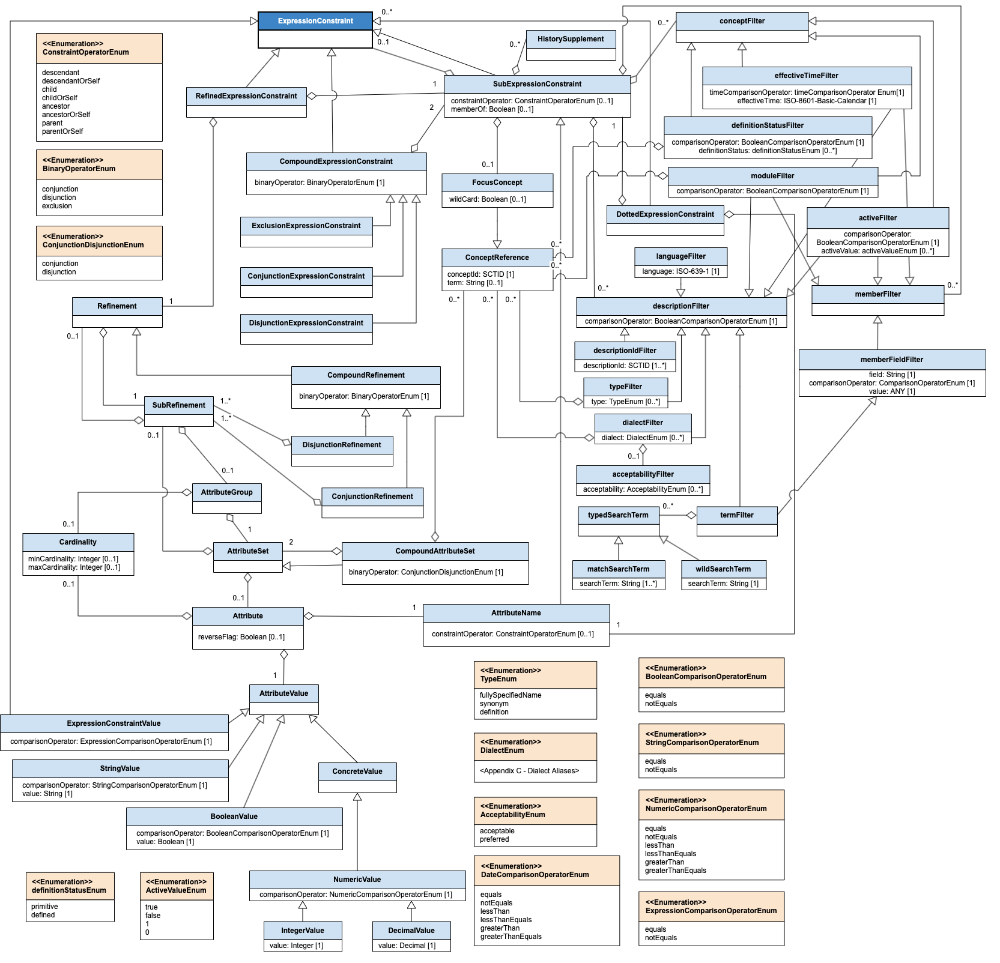

# 4.1 Details

Figure 3 below provides a non-normative representation of the logical model of the [SNOMED CT Expression Constraint Language](http://snomed.org/ecl) using a UML class diagram. Please note that each of the classes in this diagram corresponds to a rule in the syntax specification defined in [Chapter 5](5.-Syntax-Specification_28739404.html). For a short description of each of these, please refer to [Section 5.4](5.3-Informative-Comments_28739407.html).

<figure></figure>

**Figure 3: Logical Model of Expression Constraint Language**

**  
**
