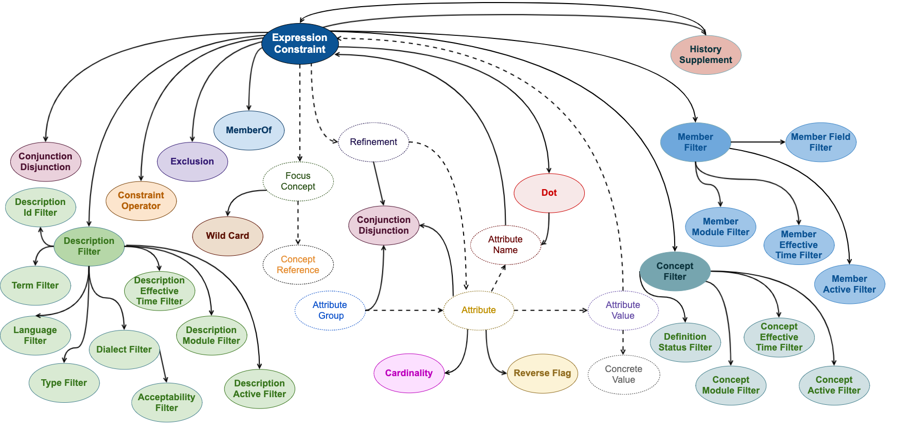
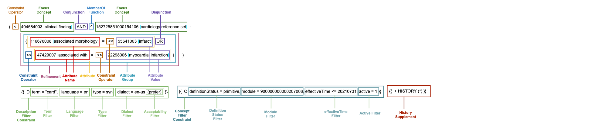

# 4. Logical Model

A SNOMED CT Expression Constraint contains either a single focus concept, or a series of focus concepts joined by either conjunction, disjunction or exclusion. Each focus concept in an Expression Constraint is either a concept reference or a wildcard, and is normally preceded by either a constraint operator or a memberOf function. An Expression Constraint may also contain a refinement, which consists of grouped or ungrouped attributes (or both). Each attribute consists of the attribute name (optionally preceded by a cardinality, reverse flag and/or attribute operator) together with the value of the attribute. The attribute name is either a concept reference or a wild card. The attribute value is either an expression constraint or a concrete value (i.e. string, integer, decimal or boolean). Conjunction or disjunction can be applied at a variety of levels, including between expression constraints, refinements, attribute groups, and attributes. An expression constraint can also be followed by a dot and attribute name pair. One or more description filters may be applied to an expression constraint, which can include description identifier, module, effective time, active status, term, language, type, dialect and acceptability criteria. Similarly, one or more concept filters may be applied to an expression constraint, which can include definition status, module, effective time and active status criteria. Member filters may be applied to results of the memberOf function, and may include module, effective time, active status and specific refset field criteria. Finally, history supplements may be applied, which include an ECL query to specify the set of historical association reference sets to be used.

Figure 1 below illustrates the overall structure of an expression constraint using an abstract representation. Those parts of an expression constraint, which are in common with [SNOMED CT Compositional Grammar](http://snomed.org/scg) expressions, are shown with dotted lines to emphasise the new features (using solid lines) in the [Expression Constraint Language](http://snomed.org/ecl). Please note that no specific semantics should be attributed to each arrow in this abstract diagram.

<figure></figure>

**Figure 1: Abstract Model of a SNOMED CT Expression Constraint**

Figure 2 below shows an example of an expression constraint[1](https://confluence.ihtsdotools.org/display/DOCECL/4.+Logical+Model#Footnote1 "Footnote: Click here to display the footnote") with the main components marked. These components will be explained further in the subsequent sections of this document.

<figure></figure>

**Figure 2: The main components of an example expression constraint**

* * *

Footnotes Ref | Notes  
---|---  
[1](https://confluence.ihtsdotools.org/display/DOCECL/4.+Logical+Model#FootnoteMarker1-0 "Footnote: Click to return to reference in text") |  The expression constraint in Figure 2 is satisfied by concepts which are clinical findings **and** members of the cardiology reference set **and** have an attribute group that either has an associated morphology of infarct (or descendant) **or** are associated with myocardial infarction (or descendant). In addition, all matching concepts must also have a description that matches the term "card", has a language of English, has a type of [ | Synonym|](http://snomed.info/id/900000000000013009 "900000000000013009 | Synonym |") and are preferred in the en-us language reference set. And matching concepts must be primitive, belong to the international core module, be published on or before 31st July 2021, and be active. The results of this expression constraint are then supplemented by any inactive concept that is associated with the active results via an historical association reference set. 
