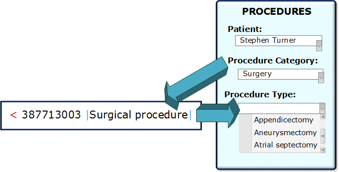
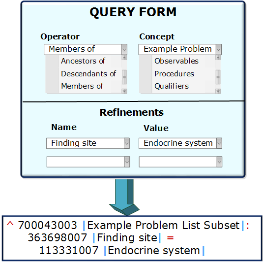

# Authoring

Authoring SNOMED CT Expression Constraints can be performed using two main techniques:

1. _Language-based authoring_ : This technique involves the author constructing a SNOMED CT Expression Constraint using one of the syntaxes defined in Chapter 5.
2. _Form-based authoring_ : This technique involves the author entering values into separate fields of a form, and the clinical system automatically composing the values together into a syntactically correct SNOMED CT Expression Constraint.

## Language-Based Authoring

Language-based authoring is useful for situations in which ad hoc expression constraints must be defined which don't necessarily conform to a consistent structure. For example, some expression constraints (e.g. those that define terminology bindings or predefined queries) may be authored by software developers during the design, development or customization of a clinical application. Other expression constraints (e.g. those used to define intentional reference sets or validation queries) may be defined by terminologists during the process of developing a SNOMED CT extension. Expression constraints may also be authored by users who wish to retrieve or analyse information stored in patient records using SNOMED CT (e.g. for clinical, epidemiological or research queries).

To use language-based authoring, the user must be familiar with the basic features of the Expression Constraint Language syntax. There are, however, a number of ways in which a tool can support the user while creating expression constraints, including:

* Validating the syntactical correctness of the expression constraint as it is authored;
* Checking the expression constraint for conformance against the concept model;
* Automatically populating or correcting the term associated with a concept reference;
* Providing integrated tools to search the SNOMED CT hierarchy for concept references to include in the expression constraint;
* Filtering the concept search to those concepts which are valid to use at the given point in the expression constraint (e.g. only showing attribute concepts, or those within the valid range of the given attribute); and
* Suggesting the set of valid operators or characters that may be used at a given point in the expression constraint;

## Form-Based Authoring

Form-based authoring is particularly useful when non-technical users need to create constraints or queries which have a consistent structure. In these situations, it may be useful to either:

* Create an 'expression constraint template' in which the attribute values are populated with the values that the user enters into the associated fields of the form;
* Create a form-driven query tool to support a useful subset of possible query structures.

One scenario in which the first form-based approach may be used is when there is a terminology-based dependency between the values of two fields on a user interface. For example, Figure 4 illustrates a simplified Procedures form in which the coded value entered into the _Procedure Type_ field must be a descendant of the coded value entered into the _Procedure Category_ field. When a _Procedure Category_ of "Surgery" (i.e. [387713003 | Surgical procedure|](http://snomed.info/id/387713003) ) is selected, the expression constraint " < [387713003 | Surgical procedure|](http://snomed.info/id/387713003) " is used to populate the value list for the _Procedure Type_ field.

<figure><figcaption>
<strong>Figure 4: Authoring using expression constraint templates</strong>
</figcaption></figure>

The second form-based authoring technique mentioned above is a form-driven query tool. Figure 5 below illustrates a very simple form-driven query tool, in which the user selects the required operator (e.g. 'ancestorOf', 'descendantOf', 'memberOf') and operand (e.g. 'Example Problem List') and then defines one or more attribute refinements.

<figure><figcaption>
<strong>Figure 5: Authoring using a form-driven query tool</strong>
</figcaption></figure>
